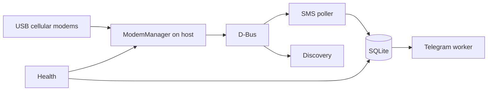

# smspi

[](https://www.gnu.org/licenses/gpl-3.0)

**smspi** is a lightweight SMS gateway for Raspberry Pi (and similar Linux hosts). It receives text messages from one or more USB cellular modems, stores them in SQLite, and forwards them to a Telegram chat via the Bot API.

Designed for **24/7 operation**: power loss, reboots, USB port changes, and temporary Telegram or modem outages are handled with retries, deduplication, and health checks.

Repository: [https://github.com/drhdev/smspi](https://github.com/drhdev/smspi)

---

## Table of contents

- [What it does](#what-it-does)
- [Components](#components)
- [Supported hardware](#supported-hardware)
- [Deployment guide (step by step)](#deployment-guide-step-by-step)
- [Configuration reference](#configuration-reference)
- [Testing](#testing)
- [Operations](#operations)
- [FAQ & troubleshooting](#faq--troubleshooting)
- [Contributing](#contributing)
- [License](#license)

---

## What it does

1. **Discovers** USB modems via [ModemManager](https://www.freedesktop.org/wiki/Software/ModemManager/) on the **host** (not inside Docker).
2. **Identifies** each modem by **IMEI** (fallback: ICCID) so `/Modem/0` vs `/Modem/1` swaps after reboot do not break mapping.
3. **Polls** new incoming SMS, stores them in **SQLite** (sender, optional name, body, local time, SIM receiving number).
4. **Forwards** each message to **Telegram** with HTML formatting, rate-limit handling, and retries.
5. **Deletes** SMS from modem storage after successful DB insert (configurable) to avoid a full SIM inbox.
6. **Runs health checks** and writes `data/.health_ok` for Docker `HEALTHCHECK`.



---

## Components

| Layer | Technology | Role |
|-------|------------|------|
| **Host OS** | Raspberry Pi OS / Debian | USB, udev, power, networking |
| **Modem stack** | ModemManager + `mmcli` | Modem mode, registration, SMS read/delete |
| **USB mode** | `usb_modeswitch` | Huawei sticks: leave HiLink / mass-storage → modem mode |
| **Application** | Python 3.11+ | Orchestrator, threads, config, logging |
| **Storage** | SQLite (WAL) | Messages, modem registry, health history |
| **Notifications** | Telegram Bot API | `sendMessage` to your chat |
| **Container (optional)** | Docker Compose | App + host D-Bus mount; MM stays on host |
| **Process manager (optional)** | systemd unit | Native venv deployment |

Worker threads (loosely coupled, configurable delays):

| Thread | Interval (default) | Task |
|--------|-------------------|------|
| SMS poller | 12 s | Light modem refresh, read SMS → DB |
| Discovery | 45 s | Full discover + enable modems |
| Telegram | 2 s+ | Send `pending`, retry `failed` periodically |
| Health | 300 s | mmcli, modem count, stale detection, stamp file |

---

## Supported hardware

### Modems

smspi talks to modems through **ModemManager**, not raw AT commands. Any stick that MM exposes as an SMS-capable modem should work. The project is **tested and documented around Huawei USB 3G/LTE dongles** (vendor `12d1`), commonly used on Pi gateways in EU (e.g. Telekom DE).

**Examples** (product IDs vary; check `lsusb`):

| Vendor:Product | Notes |
|----------------|--------|
| `12d1:1f01`, `12d1:14dc`, `12d1:1506`, `12d1:155e`, `12d1:157d`, `12d1:1001` | Typical Huawei modem-mode IDs after `usb_modeswitch` |
| Other `12d1:*` | Often supported after modeswitch; add udev rule if needed |

See `scripts/99-huawei-modem.rules` for sample udev triggers.

### 2G SMS on older 3G sticks

Many **3G-only Huawei sticks** still register on **2G (GSM)** where operators keep 2G for SMS/voice. smspi does not implement radio mode selection itself; **ModemManager** and the SIM/operator decide the access technology. If the stick registers (even on 2G) and `mmcli -m N --messaging-list-sms` shows messages, smspi will process them.

Practical notes:

- Weak 2G coverage → delayed delivery; increase `mmcli_timeout_seconds` if needed.
- Some operators sunset 2G; you may need a newer LTE stick or different SIM.
- PIN disabled or entered once via MM is strongly recommended for unattended operation.

### Host

- **Raspberry Pi 3/4/5** (or any Linux box with USB + ModemManager)
- **Powered USB hub** recommended for **multiple** dongles (under-voltage causes disconnects)
- One or more **nano-SIM** lines with SMS capability (not data-only M2M unless SMS is enabled)

---

## Deployment guide (step by step)

Read this top to bottom. **Do not skip Part 1** — ModemManager on the host is required for **both** Docker and venv.

### How the guide is structured

| Part | Who must do it | What |
|------|----------------|------|
| **Part 1** | Everyone | Install **ModemManager on the host**, plug modems, verify `mmcli` |
| **Part 2** | Everyone | Create **Telegram** bot token and chat ID |
| **Part 3** | Everyone | Create **config files** in the project directory |
| **Part 4A** *or* **4B** | Pick **one** | **4A** = Docker · **4B** = Python venv **+ systemd autostart** (all venv steps in one part) |
| **Part 5** | Everyone | **Smoke test** + send a real SMS |

There is **no** separate “quick start” that replaces these parts. Full path: Part 1 → 2 → 3 → (4A **or** 4B) → 5.

### Before you begin (hardware & accounts)

- [ ] Raspberry Pi with **Raspberry Pi OS** (or Debian), network (Ethernet/Wi‑Fi)
- [ ] USB cellular modem(s) plugged in (powered USB hub if more than one)
- [ ] SIM card(s) inserted; **PIN disabled** on the SIM (operator app or manual)
- [ ] Telegram account; you will create a **bot** in Part 2
- [ ] You decided: **Part 4A (Docker)** or **Part 4B (venv)** — write it down now

**Important:** ModemManager always runs on the **Raspberry Pi host**, never inside the smspi app alone. Docker only runs the Python app; it still uses the host’s ModemManager via D-Bus.

---

### Part 1 — Host: install ModemManager (required)

Do this **on the Pi**, **before** Docker or venv. Default project path below: `/home/pi/smspi` — change if you use another user/path.

#### Step 1.1 — Clone the project

```bash
cd ~
git clone git@github.com:drhdev/smspi.git
cd ~/smspi
```

If `git` is missing: `sudo apt-get update && sudo apt-get install -y git`

#### Step 1.2 — Run the host setup script (installs ModemManager)

This installs `modemmanager`, `usb-modeswitch`, `udev`, enables Huawei modem mode, and **enables ModemManager at boot**:

```bash
cd ~/smspi
sudo bash scripts/setup-host.sh
```

**What this script does (you do not need to run these separately if the script succeeded):**

```bash
sudo apt-get update
sudo apt-get install -y modemmanager usb-modeswitch usb-modeswitch-data udev
# sets HuaweiAltModeGlobal=1 in /etc/usb_modeswitch.conf
sudo systemctl enable --now ModemManager
```

#### Step 1.3 — Verify ModemManager is running

Run each command. **Expected** output is shown.

```bash
systemctl is-active ModemManager
```

Expected: `active`  
If not:

```bash
sudo systemctl enable --now ModemManager
sudo systemctl status ModemManager
```

```bash
which mmcli
```

Expected: a path, e.g. `/usr/bin/mmcli`

```bash
mmcli -L
```

Expected: at least one line containing `/org/freedesktop/ModemManager1/Modem/0` **after** the USB stick is plugged in.  
If the list is empty: unplug/replug the stick, wait 30 seconds, run again. Check `lsusb` for `12d1:` (Huawei).

```bash
mmcli -m 0
```

Expected: modem details; `state:` should become `registered` (may take 1–2 minutes).  
If `-m 0` fails but `-L` shows `/Modem/1`, use `mmcli -m 1` instead.

**Stop here until all checks pass.** Do not start smspi without a working `mmcli -L`.

---

### Part 2 — Telegram bot (required before start)

#### Step 2.1 — Create a bot and get the token

1. In Telegram, open [@BotFather](https://t.me/BotFather)
2. Send `/newbot`, follow prompts
3. Copy the **HTTP API token** (looks like `123456789:AAH...`)

#### Step 2.2 — Get your chat ID

1. Send **any message** to your new bot (or add the bot to a group and send a message there)
2. On the Pi (replace `TOKEN`):

```bash
curl -s "https://api.telegram.org/botTOKEN/getUpdates"
```

3. Find `"chat":{"id":` — that number is your **chat_id** (groups often start with `-100`)

You will paste token and chat_id into `.env` in Part 3.

---

### Part 3 — Configuration files (required)

Run from the project directory (`~/smspi`):

#### Step 3.1 — Create directories and copy templates

```bash
cd ~/smspi
mkdir -p config data logs
cp config.example.yaml config/config.yaml
cp .env.example .env
```

#### Step 3.2 — Edit secrets (`.env`)

```bash
nano .env
```

Set at minimum:

```bash
SMSPI_TELEGRAM_BOT_TOKEN=paste_token_from_part_2
SMSPI_TELEGRAM_CHAT_ID=paste_chat_id_from_part_2
```

Save: `Ctrl+O`, Enter, `Ctrl+X`

#### Step 3.3 — Optional: edit `config/config.yaml`

```bash
nano config/config.yaml
```

Defaults are fine for a first run. Set `app.timezone` if not `Europe/Berlin`.

**Do not commit** `config/config.yaml` or `.env` (they are gitignored).

---

### Part 4A — Run with Docker (only if you chose Docker)

Skip this entire section if you chose **Part 4B (venv)**.

#### Step 4A.1 — Install Docker (if not already installed)

```bash
sudo apt-get update
sudo apt-get install -y docker.io docker-compose-plugin
sudo usermod -aG docker "$USER"
```

Log out and log back in (or `newgrp docker`) so `docker` works without sudo.

Verify:

```bash
docker --version
docker compose version
```

#### Step 4A.2 — Build and start smspi

```bash
cd ~/smspi
docker compose up -d --build
```

#### Step 4A.3 — Check the container

```bash
docker compose ps
docker compose logs -f smspi
```

Expected in logs: `ModemManager is reachable`, `Bootstrap complete`, `All worker threads started`.  
Stop following logs: `Ctrl+C`

#### Step 4A.4 — Boot order after power loss (Docker)

On every reboot, this order must happen:

1. **ModemManager** starts (enabled in Part 1 by `setup-host.sh`)
2. **Docker** starts
3. **smspi container** starts (`restart: unless-stopped`)

Run once to enable Docker at boot:

```bash
sudo systemctl enable docker
```

Verify ModemManager is still enabled:

```bash
sudo systemctl is-enabled ModemManager
```

Expected: `enabled`

```bash
chmod +x scripts/verify-boot-order.sh
./scripts/verify-boot-order.sh
```

smspi inside Docker **waits up to 180 seconds** for ModemManager on startup; you do not install `smspi.service` for Docker.

**Continue with [Part 5](#part-5--verify-everyone)**

---

### Part 4B — Run with Python venv (only if you chose venv)

Skip this entire section if you chose **Part 4A (Docker)**.

Complete **all** steps 4B.1–4B.5 in order. Do not skip 4B.4–4B.5 on a Pi you want to run 24/7 (that is how smspi starts after reboot, **after** ModemManager).

#### Step 4B.1 — Create virtualenv and install dependencies

```bash
cd ~/smspi
python3 -m venv .venv
source .venv/bin/activate
pip install -r requirements.txt
```

#### Step 4B.2 — Run smspi in the foreground (first test)

```bash
cd ~/smspi
source .venv/bin/activate
export SMSPI_CONFIG="$PWD/config/config.yaml"
export PYTHONPATH="$PWD/src"
python -m smspi
```

Expected: `ModemManager is reachable`, `Bootstrap complete`, `All worker threads started`.  
Stop with `Ctrl+C` after you see that (systemd will run it in the background next).

If this step fails, **do not** continue — fix Part 1 (`mmcli -L`) first.

#### Step 4B.3 — Install systemd service (autostart at boot)

This installs `smspi.service` so that:

- **ModemManager is required** (`Requires=ModemManager.service`)
- smspi starts **after** ModemManager (`After=ModemManager.service`)
- smspi **does not start** if ModemManager is down (`ExecStartPre` check)

```bash
cd ~/smspi
sudo bash scripts/install-systemd.sh
```

The script will:

1. Ensure ModemManager is enabled and running  
2. Write `/etc/systemd/system/smspi.service` with **your** current directory paths  
3. `systemctl enable smspi`  
4. `systemctl start smspi`  

#### Step 4B.4 — Verify ModemManager starts before smspi

```bash
chmod +x scripts/verify-boot-order.sh
./scripts/verify-boot-order.sh
```

Manual check:

```bash
systemctl show smspi.service -p Requires -p After --no-pager
```

Expected includes:

- `Requires=ModemManager.service` (or in the Requires line)  
- `After=... ModemManager.service ...`

```bash
sudo systemctl status ModemManager
sudo systemctl status smspi
```

Both should be `active (running)`.

#### Step 4B.5 — Reboot test (recommended)

```bash
sudo reboot
```

After the Pi is back:

```bash
systemctl is-active ModemManager
systemctl is-active smspi
mmcli -L
```

Expected: both `active`, `mmcli -L` lists your modem(s).

**Continue with [Part 5](#part-5--verify-everyone)**

---

### Part 5 — Verify (everyone)

#### Step 5.1 — Smoke test

```bash
cd ~/smspi
chmod +x scripts/smoke-test.sh
./scripts/smoke-test.sh
```

Fix every `[FAIL]` before relying on production SMS.

#### Step 5.2 — End-to-end SMS test

1. From another phone, send an SMS to the SIM’s mobile number  
2. Check Telegram for the formatted message  
3. Check database:

```bash
sqlite3 ~/smspi/data/smspi.db \
  "SELECT id, sender_number, telegram_status FROM sms_messages ORDER BY id DESC LIMIT 3;"
```

Expected: `telegram_status` = `sent`

#### Step 5.3 — Logs

Docker:

```bash
cd ~/smspi
docker compose logs -f smspi
```

venv / systemd:

```bash
journalctl -u smspi -f
# or
tail -f ~/smspi/logs/smspi.log
```

---

## Configuration reference

### Files

| File | Committed | Purpose |
|------|-----------|---------|
| `config.example.yaml` | Yes | Template — copy to `config/config.yaml` |
| `config/config.yaml` | **No** (gitignored) | Your live settings |
| `.env.example` | Yes | Template for secrets |
| `.env` | **No** | Telegram token/chat_id; overrides YAML |

Environment overrides for paths:

| Variable | Overrides |
|----------|-----------|
| `SMSPI_CONFIG` | Config file path |
| `SMSPI_DB_PATH` | SQLite path |
| `SMSPI_LOG_DIR` | Log directory |
| `SMSPI_TELEGRAM_*` | Telegram credentials |

### Example `config/config.yaml`

```yaml
app:
  timezone: Europe/Berlin
  step_delay_seconds: 0.8
  recovery_wait_seconds: 5.0
  shutdown_grace_seconds: 15.0

database:
  path: data/smspi.db

logging:
  level: INFO
  directory: logs
  max_bytes: 1048576
  backup_count: 3

modem:
  poll_interval_seconds: 12
  discovery_interval_seconds: 45
  mmcli_timeout_seconds: 90
  delete_after_store: true
  operator_filter: ""          # e.g. "Telekom" to ignore other operators

telegram:
  enabled: true
  account_name: primary
  bot_token: "YOUR_BOT_TOKEN"    # prefer .env instead
  chat_id: "YOUR_CHAT_ID"
  send_interval_seconds: 2.0
  parse_mode: HTML
  show_utc_in_message: false
  failed_retry_interval_seconds: 300
  max_message_length: 4096

health:
  interval_seconds: 300
  modem_stale_seconds: 600
  stamp_file: data/.health_ok
```

### Example `.env`

```bash
SMSPI_TELEGRAM_BOT_TOKEN=123456789:AAExampleTokenFromBotFather
SMSPI_TELEGRAM_CHAT_ID=-1001234567890
SMSPI_TELEGRAM_ACCOUNT_NAME=primary
SMSPI_LOG_LEVEL=INFO
```

**Telegram message format:** HTML labels, monospace numbers, SMS body escaped. Invalid token → startup error (`getMe`). Details in Part 2.

---

## Testing

Deployment verification is **[Part 5](#part-5--verify-everyone)**. Extra checks:

### ModemManager manual

```bash
mmcli -L
mmcli -m 0
mmcli -m 0 --messaging-list-sms
```

### Python unit tests (any machine, no modem)

```bash
python3 -m venv .venv && source .venv/bin/activate
pip install -r requirements.txt
PYTHONPATH=src python -c "
from tests.test_telegram_format import test_escape_html, test_html_message_contains_labels, test_truncation_respects_limit
test_escape_html(); test_html_message_contains_labels(); test_truncation_respects_limit()
print('ok')
"
```

### 5. Logs

```bash
tail -f logs/smspi.log
# Docker:
docker compose logs -f smspi
```

---

## Operations

| Task | Command |
|------|---------|
| Backup SQLite | `./scripts/backup-db.sh` |
| Cron backup | `0 3 * * * cd /opt/smspi && ./scripts/backup-db.sh` |
| Re-queue failed Telegram | Automatic on boot + every `failed_retry_interval_seconds` |
| Health history | `sqlite3 data/smspi.db "SELECT * FROM health_checks ORDER BY id DESC LIMIT 5;"` |

---

## FAQ & troubleshooting

### Power loss or unexpected shutdown

- On boot, smspi waits up to **180 s** for ModemManager, runs full discovery, scans SMS, re-queues failed Telegram sends (batch limit configurable).
- SQLite uses **WAL**; committed rows survive abrupt power-off in normal cases.
- **Action:** follow [Part 1](#part-1--host-install-modemmanager-required) and [Part 5](#part-5--verify-everyone); Docker: `docker compose up -d` · venv: `sudo systemctl start smspi`

### Reboot / USB port changed

- Modems may appear as `/Modem/1` instead of `/Modem/0` — smspi maps by **IMEI** in `modem_registry`.
- Keep each stick in the **same physical USB port** when possible; use udev rules for stability.
- **Action:** wait for discovery cycle (~45 s) or restart service.

### PIN code

- ModemManager may block registration until PIN is entered.
- **Recommended:** disable PIN on the SIM (operator app) or unlock once with `mmcli -i 0 --pin=XXXX` (index varies).
- smspi does **not** store or manage PINs.

### APN / mobile data

- SMS reception usually requires **network registration**, not necessarily working mobile data.
- Many consumer SIMs (e.g. Telekom DE) set APN automatically.
- If `mmcli -m 0` shows not registered, fix SIM/antenna/coverage first; check operator APN docs for M2M SIMs.

### No network / weak signal (2G/3G/4G)

- Symptom: `state: failed` or `searching`, no SMS.
- **Action:** antenna, better placement, powered hub, fewer concurrent modems on one bus.

### `mmcli -L` empty

```bash
sudo systemctl restart ModemManager
lsusb
sudo usb_modeswitch -v 12d1 -p <product> -J   # if still storage mode
```

Ensure `usb_modeswitch` ≥ 2.5.2 and `HuaweiAltModeGlobal=1`.

### SMS not arriving in smspi

- Test with `mmcli -m N --messaging-list-sms`.
- SIM storage full → enable `delete_after_store: true` (uses `--messaging-delete-sms`).
- Check logs for poller errors.

### Telegram `failed` status

- Wrong token/chat_id, bot blocked, or no internet on the Pi.
- Fix credentials; failed rows retry on interval and on boot.
- Rate limit **429**: smspi waits `retry_after` from the API.

### Docker container `unhealthy`

- Missing `data/.health_ok` → health check failed (no modems, MM down, etc.).
- **Action:** `./scripts/smoke-test.sh`, `docker compose logs smspi`.

### D-Bus errors in container

- Mount `/run/dbus`, run ModemManager on **host**, use `user: "0:0"` in Compose.

### Multiple modems

- Use a **powered USB hub**.
- Increase `step_delay_seconds` / `poll_interval_seconds` if the Pi is overloaded.

---

## Contributing

Contributions are welcome. This is a **public** project — feel free to **fork**, open issues, and send pull requests on GitHub.

1. Fork [drhdev/smspi](https://github.com/drhdev/smspi)
2. Create a branch (`git checkout -b feature/my-change`)
3. Commit with clear messages
4. Push and open a PR
5. Ensure `./scripts/smoke-test.sh` passes on a Pi when touching modem integration

See [CONTRIBUTING.md](CONTRIBUTING.md) for details.

---

## License

This project is licensed under the **GNU General Public License v3** (or later). See [LICENSE](LICENSE) and [https://www.gnu.org/licenses/gpl-3.0.html](https://www.gnu.org/licenses/gpl-3.0.html).
