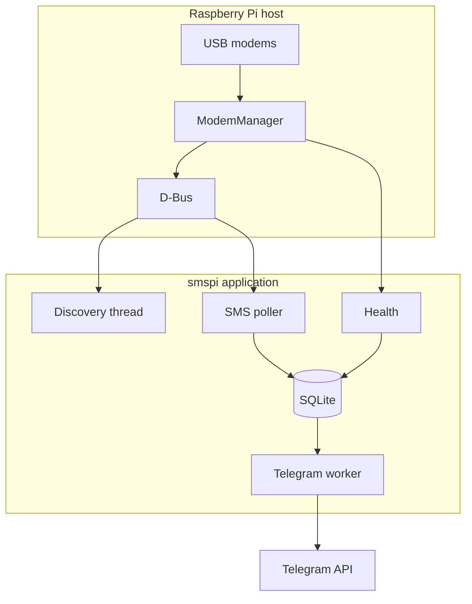

# smspi

[](https://www.gnu.org/licenses/gpl-3.0)
[](https://www.python.org/downloads/)
[]()

Multi-modem SMS gateway for Raspberry Pi. Receives SMS from USB cellular modems, stores them in SQLite, and forwards them to Telegram.

**Repository:** [github.com/drhdev/smspi](https://github.com/drhdev/smspi)

---

## Table of contents

1. [Overview](#overview)
2. [Architecture](#architecture)
3. [Requirements](#requirements)
4. [Installation](#installation)
   - [Roadmap](#roadmap)
   - [Part 1 — Host & ModemManager](#part-1--host--modemmanager)
   - [Part 2 — Telegram](#part-2--telegram)
   - [Part 3 — Configuration](#part-3--configuration)
   - [Part 4A — Docker](#part-4a--docker)
   - [Part 4B — Python venv & systemd](#part-4b--python-venv--systemd)
   - [Part 5 — Verification](#part-5--verification)
5. [Configuration reference](#configuration-reference)
6. [Project layout & scripts](#project-layout--scripts)
7. [Day-to-day operations](#day-to-day-operations)
8. [Troubleshooting](#troubleshooting)
9. [Contributing](#contributing)
10. [License](#license)

---

## Overview

smspi is built for **unattended 24/7 use** on a Raspberry Pi:

| Capability | Description |
|------------|-------------|
| Multi-modem | Several USB sticks; stable mapping by **IMEI** (not `/Modem/0`) |
| Resilience | Survives reboot, power loss, USB reordering, Telegram outages |
| Storage | SQLite (WAL) with deduplication by modem SMS path |
| Notifications | Telegram Bot API with HTML messages and rate-limit handling |
| Health | Periodic self-checks + Docker `HEALTHCHECK` stamp file |

**Runtime rule:** [ModemManager](https://www.freedesktop.org/wiki/Software/ModemManager/) always runs on the **host**. Docker (if used) only runs the Python application and talks to the host via D-Bus.

---

## Architecture



### Stack

| Layer | Components |
|-------|------------|
| Host | Raspberry Pi OS / Debian, `udev`, `usb_modeswitch` |
| Modems | ModemManager, `mmcli`, Huawei `12d1:*` (primary target) |
| Application | Python 3.11+, threaded orchestrator |
| Persistence | SQLite (`sms_messages`, `modem_registry`, `health_checks`) |
| Alerts | Telegram `sendMessage` |
| Deploy | **Docker Compose** *or* **venv + systemd** |

### Worker threads

| Thread | Default interval | Role |
|--------|------------------|------|
| SMS poller | 12 s | Refresh modems, read SMS → DB |
| Discovery | 45 s | Discover, enable modems, update registry |
| Telegram | ≥ 2 s | Send `pending`, retry `failed` |
| Health | 300 s | Self-check, write `data/.health_ok` |

---

## Requirements

### Hardware

- Raspberry Pi 3 / 4 / 5 (or Linux PC with USB)
- USB cellular modem(s); **Huawei** `12d1:*` documented (see `scripts/99-huawei-modem.rules`)
- **Powered USB hub** when using more than one stick
- nano-SIM per modem with **SMS enabled**; **PIN disabled** for unattended use

### Software

| Component | Docker path | venv path |
|-----------|-------------|-----------|
| ModemManager on host | Required | Required |
| `mmcli` | Required | Required |
| Docker + Compose | Required | — |
| Python 3.11+ venv | — | Required |
| Telegram bot token + chat ID | Required | Required |

### Supported modems & 2G

Any modem **ModemManager** exposes for SMS should work. Tested with Huawei USB 3G/LTE dongles after `usb_modeswitch`.

| `lsusb` ID (examples) | Notes |
|------------------------|--------|
| `12d1:155e`, `12d1:1506`, `12d1:14dc`, `12d1:1f01`, … | Common modem-mode IDs |

Older **3G sticks** often still receive SMS on **2G (GSM)** where the operator keeps 2G. smspi does not pick the radio mode; if `mmcli -m N` shows `registered` and SMS list works, forwarding works.

---

## Installation

Follow the parts **in order**. Do not skip Part 1.

Default paths use `~/smspi` and user `pi` — adjust if needed.

### Roadmap

```text
Part 1  Host + ModemManager     →  everyone, always first
Part 2  Telegram bot            →  everyone
Part 3  config.yaml + .env      →  everyone
         ┌──────────────────────┴──────────────────────┐
Part 4A  Docker              Part 4B  venv + systemd   →  pick ONE
         └──────────────────────┬──────────────────────┘
Part 5  smoke test + test SMS   →  everyone
```

| Part | Audience | Summary |
|:----:|----------|---------|
| **1** | All | Clone repo, `setup-host.sh`, verify `mmcli` |
| **2** | All | BotFather token + chat ID |
| **3** | All | `config/config.yaml`, `.env` |
| **4A** | Docker | `docker compose up` |
| **4B** | venv | venv → test run → `install-systemd.sh` → reboot test |
| **5** | All | `smoke-test.sh`, send SMS, check logs |

> **Choose one runtime before Part 4:** Docker (4A) **or** venv (4B), not both.

---

### Part 1 — Host & ModemManager

**Goal:** ModemManager installed, enabled at boot, modems visible to `mmcli`.

#### 1.1 Clone repository

```bash
cd ~
git clone git@github.com:drhdev/smspi.git
cd ~/smspi
```

#### 1.2 Install host packages

```bash
cd ~/smspi
sudo bash scripts/setup-host.sh
```

Installs `modemmanager`, `usb-modeswitch`, `udev`, sets `HuaweiAltModeGlobal=1`, runs `systemctl enable --now ModemManager`.

#### 1.3 Verify (all must pass)

| Command | Expected |
|---------|----------|
| `systemctl is-active ModemManager` | `active` |
| `which mmcli` | path, e.g. `/usr/bin/mmcli` |
| `mmcli -L` | line with `/Modem/0` (after stick plugged in) |
| `mmcli -m 0` | details; `state: registered` (wait 1–2 min) |

If `-m 0` fails but `-L` shows `/Modem/1`, use `mmcli -m 1`.

**Stop if verification fails** — do not continue to Part 4.

---

### Part 2 — Telegram

#### 2.1 Bot token

1. Open [@BotFather](https://t.me/BotFather) → `/newbot`
2. Copy the API token (`123456789:AAH…`)

#### 2.2 Chat ID

1. Send a message to the bot (or post in a group with the bot).
2. On the Pi:

```bash
curl -s "https://api.telegram.org/bot<TOKEN>/getUpdates"
```

3. Use `"chat":{"id": …}` as `SMSPI_TELEGRAM_CHAT_ID` (groups: often `-100…`).

---

### Part 3 — Configuration

```bash
cd ~/smspi
mkdir -p config data logs
cp config.example.yaml config/config.yaml
cp .env.example .env
nano .env    # token + chat_id from Part 2
nano config/config.yaml   # optional; defaults OK
```

| File | Git | Purpose |
|------|-----|---------|
| `config/config.yaml` | ignored | Main settings |
| `.env` | ignored | Telegram secrets (recommended) |

---

### Part 4A — Docker

Skip if you use **Part 4B**.

#### 4A.1 Install Docker

```bash
sudo apt-get update
sudo apt-get install -y docker.io docker-compose-plugin
sudo usermod -aG docker "$USER"
```

Log out and back in, then: `docker compose version`

#### 4A.2 Start smspi

```bash
cd ~/smspi
docker compose up -d --build
docker compose logs -f smspi
```

Logs should include `Bootstrap complete`. Exit logs with `Ctrl+C`.

#### 4A.3 Boot order

```bash
sudo systemctl enable docker
sudo systemctl is-enabled ModemManager   # must print: enabled
./scripts/verify-boot-order.sh
```

Boot sequence: **ModemManager → Docker → container** (`restart: unless-stopped`). No `smspi.service` for Docker.

→ Continue to [Part 5](#part-5--verification).

---

### Part 4B — Python venv & systemd

Skip if you use **Part 4A**. Complete **4B.1–4B.5** in order.

#### 4B.1 Virtual environment

```bash
cd ~/smspi
python3 -m venv .venv
source .venv/bin/activate
pip install -r requirements.txt
```

#### 4B.2 Foreground test

```bash
cd ~/smspi
source .venv/bin/activate
export SMSPI_CONFIG="$PWD/config/config.yaml"
export PYTHONPATH="$PWD/src"
python -m smspi
```

Expect `Bootstrap complete`, then `Ctrl+C`. If this fails, return to [Part 1](#part-1--host--modemmanager).

#### 4B.3 systemd service

```bash
cd ~/smspi
sudo bash scripts/install-systemd.sh
```

Creates `/etc/systemd/system/smspi.service` with:

- `Requires=ModemManager.service`
- `After=ModemManager.service`
- `ExecStartPre` checks ModemManager is active

#### 4B.4 Verify service order

```bash
./scripts/verify-boot-order.sh
sudo systemctl status ModemManager smspi
```

#### 4B.5 Reboot test

```bash
sudo reboot
# after login:
systemctl is-active ModemManager smspi
mmcli -L
```

→ Continue to [Part 5](#part-5--verification).

---

### Part 5 — Verification

#### 5.1 Smoke test

```bash
cd ~/smspi
chmod +x scripts/smoke-test.sh
./scripts/smoke-test.sh
```

Resolve every `[FAIL]` line.

#### 5.2 End-to-end SMS

1. Send SMS to the SIM’s phone number from another handset.
2. Confirm message in Telegram.
3. Confirm database:

```bash
sqlite3 ~/smspi/data/smspi.db \
  "SELECT id, sender_number, telegram_status FROM sms_messages ORDER BY id DESC LIMIT 3;"
```

`telegram_status` should be `sent`.

#### 5.3 Logs

| Runtime | Command |
|---------|---------|
| Docker | `docker compose logs -f smspi` |
| systemd | `journalctl -u smspi -f` |
| File | `tail -f ~/smspi/logs/smspi.log` |

---

## Configuration reference

Full template: [`config.example.yaml`](config.example.yaml).

### Environment variables

| Variable | Description |
|----------|-------------|
| `SMSPI_CONFIG` | Path to `config.yaml` |
| `SMSPI_DB_PATH` | SQLite file path |
| `SMSPI_LOG_DIR` | Log directory |
| `SMSPI_TELEGRAM_BOT_TOKEN` | Overrides YAML `bot_token` |
| `SMSPI_TELEGRAM_CHAT_ID` | Overrides YAML `chat_id` |
| `SMSPI_TELEGRAM_ACCOUNT_NAME` | Label stored per message |
| `SMSPI_LOG_LEVEL` | `INFO`, `DEBUG`, … |

### Minimal `config/config.yaml`

```yaml
app:
  timezone: Europe/Berlin

database:
  path: data/smspi.db

modem:
  delete_after_store: true

telegram:
  enabled: true
  parse_mode: HTML
  send_interval_seconds: 2.0

health:
  stamp_file: data/.health_ok
```

Secrets belong in `.env` (see [`.env.example`](.env.example)).

### Telegram message format

HTML layout: labeled fields, monospace phone numbers, escaped SMS body, UTF-16 length limit. Invalid token fails at startup (`getMe`).

---

## Project layout & scripts

```text
smspi/
├── config.example.yaml      # copy → config/config.yaml
├── .env.example             # copy → .env
├── docker-compose.yml       # Part 4A
├── scripts/
│   ├── setup-host.sh        # Part 1 — ModemManager
│   ├── install-systemd.sh   # Part 4B.3
│   ├── verify-boot-order.sh # Part 4A.3 / 4B.4
│   ├── smoke-test.sh        # Part 5.1
│   └── backup-db.sh
├── src/smspi/               # application code
├── systemd/smspi.service    # template for 4B
└── data/ logs/              # created at runtime (gitignored)
```

| Script | When to run |
|--------|-------------|
| `setup-host.sh` | Once, Part 1 |
| `install-systemd.sh` | Part 4B.3 (venv only) |
| `verify-boot-order.sh` | After 4A.3 or 4B.4 |
| `smoke-test.sh` | Part 5.1 |
| `backup-db.sh` | Cron / manual backups |

---

## Day-to-day operations

| Task | Command |
|------|---------|
| Restart (Docker) | `docker compose restart smspi` |
| Restart (venv) | `sudo systemctl restart smspi` |
| Backup database | `./scripts/backup-db.sh` |
| View health history | `sqlite3 data/smspi.db "SELECT * FROM health_checks ORDER BY id DESC LIMIT 5;"` |
| Retry failed Telegram | Automatic on boot + `failed_retry_interval_seconds` |

**Cron backup example:** `0 3 * * * cd /home/pi/smspi && ./scripts/backup-db.sh`

---

## Troubleshooting

| Symptom | Likely cause | What to do |
|---------|--------------|------------|
| `mmcli -L` empty | Stick in storage mode, MM down | `sudo systemctl restart ModemManager`; replug USB; `setup-host.sh` |
| Not `registered` | PIN, no coverage, bad SIM | Disable PIN; check antenna; `mmcli -m 0` |
| No SMS in smspi | Full SIM storage, poller error | `mmcli -m 0 --messaging-list-sms`; ensure `delete_after_store: true` |
| Telegram `failed` | Bad token/chat, no internet | Fix `.env`; check `curl` to api.telegram.org |
| Docker `unhealthy` | Health check failed | `./scripts/smoke-test.sh`; `docker compose logs smspi` |
| D-Bus error in container | MM not on host / no dbus mount | Part 1; check `docker-compose.yml` `/run/dbus` |
| Wrong modem after reboot | Normal index swap | IMEI mapping handles it; wait ~45 s discovery |
| Power loss | Expected | Reboot → MM → app; WAL DB; auto retry Telegram |

**Manual modem check:**

```bash
mmcli -L
mmcli -m 0
mmcli -m 0 --messaging-list-sms
```

**Development tests (no hardware):**

```bash
python3 -m venv .venv && source .venv/bin/activate
pip install -r requirements.txt
PYTHONPATH=src python -c "from tests.test_telegram_format import *; test_escape_html(); test_html_message_contains_labels(); print('ok')"
```

---

## Contributing

Public project — forks and pull requests welcome.

1. Fork [drhdev/smspi](https://github.com/drhdev/smspi)
2. Branch → change → PR
3. Run `./scripts/smoke-test.sh` on a Pi for modem-related changes

Details: [CONTRIBUTING.md](CONTRIBUTING.md)

---

## License

Licensed under [GNU GPL v3.0 or later](LICENSE).
