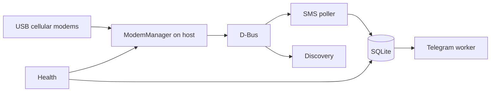

# smspi

[](https://www.gnu.org/licenses/gpl-3.0)

**smspi** is a lightweight SMS gateway for Raspberry Pi (and similar Linux hosts). It receives text messages from one or more USB cellular modems, stores them in SQLite, and forwards them to a Telegram chat via the Bot API.

Designed for **24/7 operation**: power loss, reboots, USB port changes, and temporary Telegram or modem outages are handled with retries, deduplication, and health checks.

Repository: [https://github.com/drhdev/smspi](https://github.com/drhdev/smspi)

---

## Table of contents

- [What it does](#what-it-does)
- [Components](#components)
- [Supported hardware](#supported-hardware)
- [Requirements](#requirements)
- [Quick start](#quick-start)
- [Deployment: Docker](#deployment-docker)
- [Deployment: Python venv (no Docker)](#deployment-python-venv-no-docker)
- [Configuration](#configuration)
- [Telegram setup](#telegram-setup)
- [Testing](#testing)
- [Operations](#operations)
- [FAQ & troubleshooting](#faq--troubleshooting)
- [Contributing](#contributing)
- [License](#license)

---

## What it does

1. **Discovers** USB modems via [ModemManager](https://www.freedesktop.org/wiki/Software/ModemManager/) on the **host** (not inside Docker).
2. **Identifies** each modem by **IMEI** (fallback: ICCID) so `/Modem/0` vs `/Modem/1` swaps after reboot do not break mapping.
3. **Polls** new incoming SMS, stores them in **SQLite** (sender, optional name, body, local time, SIM receiving number).
4. **Forwards** each message to **Telegram** with HTML formatting, rate-limit handling, and retries.
5. **Deletes** SMS from modem storage after successful DB insert (configurable) to avoid a full SIM inbox.
6. **Runs health checks** and writes `data/.health_ok` for Docker `HEALTHCHECK`.



---

## Components

| Layer | Technology | Role |
|-------|------------|------|
| **Host OS** | Raspberry Pi OS / Debian | USB, udev, power, networking |
| **Modem stack** | ModemManager + `mmcli` | Modem mode, registration, SMS read/delete |
| **USB mode** | `usb_modeswitch` | Huawei sticks: leave HiLink / mass-storage → modem mode |
| **Application** | Python 3.11+ | Orchestrator, threads, config, logging |
| **Storage** | SQLite (WAL) | Messages, modem registry, health history |
| **Notifications** | Telegram Bot API | `sendMessage` to your chat |
| **Container (optional)** | Docker Compose | App + host D-Bus mount; MM stays on host |
| **Process manager (optional)** | systemd unit | Native venv deployment |

Worker threads (loosely coupled, configurable delays):

| Thread | Interval (default) | Task |
|--------|-------------------|------|
| SMS poller | 12 s | Light modem refresh, read SMS → DB |
| Discovery | 45 s | Full discover + enable modems |
| Telegram | 2 s+ | Send `pending`, retry `failed` periodically |
| Health | 300 s | mmcli, modem count, stale detection, stamp file |

---

## Supported hardware

### Modems

smspi talks to modems through **ModemManager**, not raw AT commands. Any stick that MM exposes as an SMS-capable modem should work. The project is **tested and documented around Huawei USB 3G/LTE dongles** (vendor `12d1`), commonly used on Pi gateways in EU (e.g. Telekom DE).

**Examples** (product IDs vary; check `lsusb`):

| Vendor:Product | Notes |
|----------------|--------|
| `12d1:1f01`, `12d1:14dc`, `12d1:1506`, `12d1:155e`, `12d1:157d`, `12d1:1001` | Typical Huawei modem-mode IDs after `usb_modeswitch` |
| Other `12d1:*` | Often supported after modeswitch; add udev rule if needed |

See `scripts/99-huawei-modem.rules` for sample udev triggers.

### 2G SMS on older 3G sticks

Many **3G-only Huawei sticks** still register on **2G (GSM)** where operators keep 2G for SMS/voice. smspi does not implement radio mode selection itself; **ModemManager** and the SIM/operator decide the access technology. If the stick registers (even on 2G) and `mmcli -m N --messaging-list-sms` shows messages, smspi will process them.

Practical notes:

- Weak 2G coverage → delayed delivery; increase `mmcli_timeout_seconds` if needed.
- Some operators sunset 2G; you may need a newer LTE stick or different SIM.
- PIN disabled or entered once via MM is strongly recommended for unattended operation.

### Host

- **Raspberry Pi 3/4/5** (or any Linux box with USB + ModemManager)
- **Powered USB hub** recommended for **multiple** dongles (under-voltage causes disconnects)
- One or more **nano-SIM** lines with SMS capability (not data-only M2M unless SMS is enabled)

---

## Requirements

**On the host (always):**

- `modemmanager`, `usb-modeswitch`, `udev`
- Huawei: `HuaweiAltModeGlobal=1` in `/etc/usb_modeswitch.conf` (see `scripts/setup-host.sh`)
- D-Bus system bus (`/run/dbus/system_bus_socket`)

**For Docker:**

- Docker + Compose plugin
- Container runs as **root** (`user: "0:0"`) for Polkit/D-Bus access to `mmcli`

**For venv:**

- Python 3.11+
- Same host packages; app runs as a user in group `dialout` if Polkit requires it (often root-free MM on Pi is OK for `mmcli`)

---

## Quick start

```bash
git clone git@github.com:drhdev/smspi.git
cd smspi

# Host preparation (once, on the Pi)
sudo bash scripts/setup-host.sh

# Configuration
mkdir -p config data logs
cp config.example.yaml config/config.yaml
cp .env.example .env
# Edit config/config.yaml and .env (Telegram token, chat id)

# Docker (recommended)
docker compose up -d --build
docker compose logs -f smspi

# Verify
chmod +x scripts/smoke-test.sh
./scripts/smoke-test.sh
```

Send a test SMS to your SIM number; you should see a Telegram message and a row in SQLite.

---

## Deployment: Docker

ModemManager **must run on the host**. The container only uses `mmcli` over D-Bus.

```bash
cp config.example.yaml config/config.yaml
cp .env.example .env
nano config/config.yaml
nano .env

docker compose up -d --build
docker compose ps
docker compose logs -f smspi
```

| Volume / mount | Purpose |
|----------------|---------|
| `/run/dbus` | System D-Bus for `mmcli` |
| `./config/config.yaml` | Main config |
| `./data` | SQLite + `data/.health_ok` |
| `./logs` | Rotating `smspi.log` |

Environment variables (from `.env` or shell):

| Variable | Description |
|----------|-------------|
| `SMSPI_TELEGRAM_BOT_TOKEN` | Bot token from [@BotFather](https://t.me/BotFather) |
| `SMSPI_TELEGRAM_CHAT_ID` | Target chat ID |
| `SMSPI_TELEGRAM_ACCOUNT_NAME` | Label stored in DB (default: `primary`) |
| `SMSPI_LOG_LEVEL` | e.g. `INFO`, `DEBUG` |

Restart after config change:

```bash
docker compose restart smspi
```

---

## Deployment: Python venv (no Docker)

```bash
cd smspi
python3 -m venv .venv
source .venv/bin/activate
pip install -r requirements.txt

mkdir -p config data logs
cp config.example.yaml config/config.yaml
cp .env.example .env
# export secrets or rely on config.yaml

export SMSPI_CONFIG="$(pwd)/config/config.yaml"
export PYTHONPATH="$(pwd)/src"
python -m smspi
```

### systemd (optional)

Copy the project to e.g. `/opt/smspi`, create the venv, then adjust and enable:

```bash
sudo cp systemd/smspi.service /etc/systemd/system/
sudo systemctl edit smspi   # fix paths if needed
sudo systemctl enable --now smspi
```

Ensure `ModemManager.service` starts before smspi (`After=ModemManager.service` is already in the unit).

---

## Configuration

### Files

| File | Committed | Purpose |
|------|-----------|---------|
| `config.example.yaml` | Yes | Template — copy to `config/config.yaml` |
| `config/config.yaml` | **No** (gitignored) | Your live settings |
| `.env.example` | Yes | Template for secrets |
| `.env` | **No** | Telegram token/chat_id; overrides YAML |

Environment overrides for paths:

| Variable | Overrides |
|----------|-----------|
| `SMSPI_CONFIG` | Config file path |
| `SMSPI_DB_PATH` | SQLite path |
| `SMSPI_LOG_DIR` | Log directory |
| `SMSPI_TELEGRAM_*` | Telegram credentials |

### Example `config/config.yaml`

```yaml
app:
  timezone: Europe/Berlin
  step_delay_seconds: 0.8
  recovery_wait_seconds: 5.0
  shutdown_grace_seconds: 15.0

database:
  path: data/smspi.db

logging:
  level: INFO
  directory: logs
  max_bytes: 1048576
  backup_count: 3

modem:
  poll_interval_seconds: 12
  discovery_interval_seconds: 45
  mmcli_timeout_seconds: 90
  delete_after_store: true
  operator_filter: ""          # e.g. "Telekom" to ignore other operators

telegram:
  enabled: true
  account_name: primary
  bot_token: "YOUR_BOT_TOKEN"    # prefer .env instead
  chat_id: "YOUR_CHAT_ID"
  send_interval_seconds: 2.0
  parse_mode: HTML
  show_utc_in_message: false
  failed_retry_interval_seconds: 300
  max_message_length: 4096

health:
  interval_seconds: 300
  modem_stale_seconds: 600
  stamp_file: data/.health_ok
```

### Example `.env`

```bash
SMSPI_TELEGRAM_BOT_TOKEN=123456789:AAExampleTokenFromBotFather
SMSPI_TELEGRAM_CHAT_ID=-1001234567890
SMSPI_TELEGRAM_ACCOUNT_NAME=primary
SMSPI_LOG_LEVEL=INFO
```

---

## Telegram setup

1. Open [@BotFather](https://t.me/BotFather) → `/newbot` → copy the **token**.
2. Send any message to your bot (or add it to a group).
3. Get **chat_id**:
   ```bash
   curl -s "https://api.telegram.org/bot<TOKEN>/getUpdates" | jq .
   ```
   Use `message.chat.id` (groups often start with `-100…`).
4. Put token and chat_id in `.env` or `config.yaml`.
5. On start, smspi calls `getMe` — invalid tokens fail fast with a log error.

**Message format (HTML):** bold headers, monospace phone numbers, separator, SMS body (HTML-escaped). Long texts are truncated per Telegram UTF-16 limits.

---

## Testing

### 1. Smoke test (host)

```bash
chmod +x scripts/smoke-test.sh scripts/backup-db.sh
./scripts/smoke-test.sh
```

Checks: `mmcli`, D-Bus, ModemManager, modems, config, DB, health stamp, optional Docker/Telegram.

### 2. ModemManager manual

```bash
mmcli -L
mmcli -m 0
mmcli -m 0 --messaging-list-sms
```

Expect `state: registered` (or similar) and SMS paths when messages arrive.

### 3. End-to-end SMS

1. Start smspi (Docker or venv).
2. Send an SMS to the SIM’s mobile number from another phone.
3. Confirm Telegram delivery.
4. Inspect DB:
   ```bash
   sqlite3 data/smspi.db \
     "SELECT id, sender_number, recipient_number, telegram_status, body FROM sms_messages ORDER BY id DESC LIMIT 3;"
   ```
5. If `delete_after_store: true`, modem list should not keep old messages:
   ```bash
   mmcli -m 0 --messaging-list-sms
   ```

### 4. Python unit tests (dev machine)

```bash
python3 -m venv .venv && source .venv/bin/activate
pip install -r requirements.txt
PYTHONPATH=src python -c "
from tests.test_telegram_format import test_escape_html, test_html_message_contains_labels, test_truncation_respects_limit
test_escape_html(); test_html_message_contains_labels(); test_truncation_respects_limit()
print('ok')
"
```

### 5. Logs

```bash
tail -f logs/smspi.log
# Docker:
docker compose logs -f smspi
```

---

## Operations

| Task | Command |
|------|---------|
| Backup SQLite | `./scripts/backup-db.sh` |
| Cron backup | `0 3 * * * cd /opt/smspi && ./scripts/backup-db.sh` |
| Re-queue failed Telegram | Automatic on boot + every `failed_retry_interval_seconds` |
| Health history | `sqlite3 data/smspi.db "SELECT * FROM health_checks ORDER BY id DESC LIMIT 5;"` |

---

## FAQ & troubleshooting

### Power loss or unexpected shutdown

- On boot, smspi waits up to **180 s** for ModemManager, runs full discovery, scans SMS, re-queues failed Telegram sends (batch limit configurable).
- SQLite uses **WAL**; committed rows survive abrupt power-off in normal cases.
- **Action:** `docker compose up -d` or `systemctl start smspi`; run `./scripts/smoke-test.sh`.

### Reboot / USB port changed

- Modems may appear as `/Modem/1` instead of `/Modem/0` — smspi maps by **IMEI** in `modem_registry`.
- Keep each stick in the **same physical USB port** when possible; use udev rules for stability.
- **Action:** wait for discovery cycle (~45 s) or restart service.

### PIN code

- ModemManager may block registration until PIN is entered.
- **Recommended:** disable PIN on the SIM (operator app) or unlock once with `mmcli -i 0 --pin=XXXX` (index varies).
- smspi does **not** store or manage PINs.

### APN / mobile data

- SMS reception usually requires **network registration**, not necessarily working mobile data.
- Many consumer SIMs (e.g. Telekom DE) set APN automatically.
- If `mmcli -m 0` shows not registered, fix SIM/antenna/coverage first; check operator APN docs for M2M SIMs.

### No network / weak signal (2G/3G/4G)

- Symptom: `state: failed` or `searching`, no SMS.
- **Action:** antenna, better placement, powered hub, fewer concurrent modems on one bus.

### `mmcli -L` empty

```bash
sudo systemctl restart ModemManager
lsusb
sudo usb_modeswitch -v 12d1 -p <product> -J   # if still storage mode
```

Ensure `usb_modeswitch` ≥ 2.5.2 and `HuaweiAltModeGlobal=1`.

### SMS not arriving in smspi

- Test with `mmcli -m N --messaging-list-sms`.
- SIM storage full → enable `delete_after_store: true` (uses `--messaging-delete-sms`).
- Check logs for poller errors.

### Telegram `failed` status

- Wrong token/chat_id, bot blocked, or no internet on the Pi.
- Fix credentials; failed rows retry on interval and on boot.
- Rate limit **429**: smspi waits `retry_after` from the API.

### Docker container `unhealthy`

- Missing `data/.health_ok` → health check failed (no modems, MM down, etc.).
- **Action:** `./scripts/smoke-test.sh`, `docker compose logs smspi`.

### D-Bus errors in container

- Mount `/run/dbus`, run ModemManager on **host**, use `user: "0:0"` in Compose.

### Multiple modems

- Use a **powered USB hub**.
- Increase `step_delay_seconds` / `poll_interval_seconds` if the Pi is overloaded.

---

## Contributing

Contributions are welcome. This is a **public** project — feel free to **fork**, open issues, and send pull requests on GitHub.

1. Fork [drhdev/smspi](https://github.com/drhdev/smspi)
2. Create a branch (`git checkout -b feature/my-change`)
3. Commit with clear messages
4. Push and open a PR
5. Ensure `./scripts/smoke-test.sh` passes on a Pi when touching modem integration

See [CONTRIBUTING.md](CONTRIBUTING.md) for details.

---

## License

Copyright (C) 2026 drhdev and contributors.

This program is free software: you can redistribute it and/or modify it under the terms of the **GNU General Public License v3** (or later). See [LICENSE](LICENSE) and [https://www.gnu.org/licenses/gpl-3.0.html](https://www.gnu.org/licenses/gpl-3.0.html).
